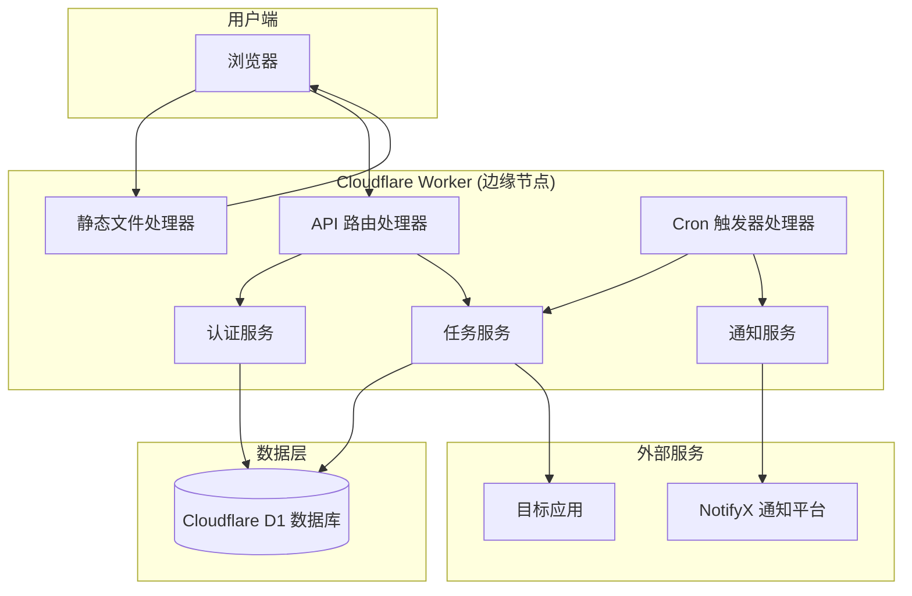
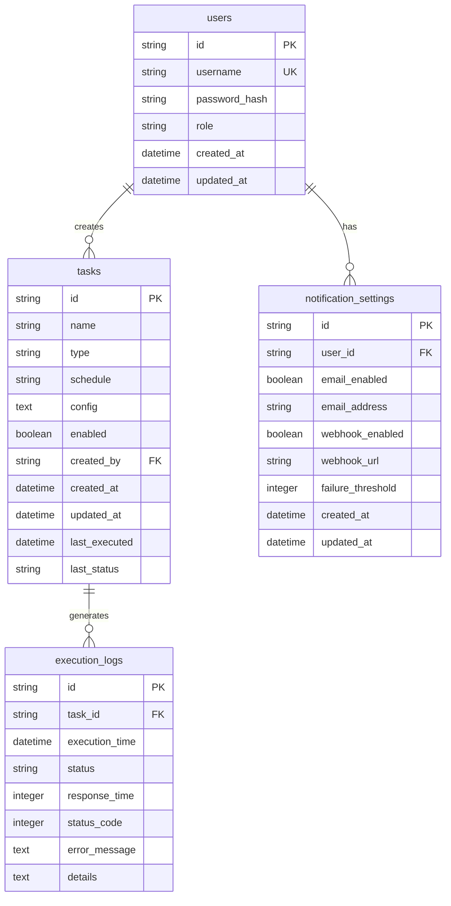

# 设计文档

## 概述

定时任务管理系统是一个基于Cloudflare Worker的无服务器应用，支持两种类型的定时任务：保活任务和通知任务。系统采用现代Web架构，前端使用Vue.js构建用户界面，后端使用Cloudflare Worker处理API请求和定时任务执行，数据存储在Cloudflare D1 SQLite数据库中。

系统的核心价值在于提供一个简单、可靠的平台来管理各种定时任务，无论是保持应用活跃状态还是发送定时通知提醒。

## 架构

### 整体架构



### 项目结构

使用Wrangler进行开发，确保前后端代码分离：

```
project-root/
├── wrangler.toml                 # Wrangler配置文件
├── package.json                  # 项目依赖
├── tsconfig.json                 # TypeScript配置文件
├── src/                         # 后端代码
│   ├── index.ts                 # Worker入口文件
│   ├── routes/                  # API路由
│   │   ├── auth.ts
│   │   ├── tasks.ts
│   │   ├── logs.ts
│   │   └── health.ts
│   ├── services/                # 业务服务
│   │   ├── auth.service.ts
│   │   ├── task.service.ts
│   │   ├── notification.service.ts
│   │   └── cron.service.ts
│   ├── models/                  # 数据模型
│   │   ├── user.model.ts
│   │   ├── task.model.ts
│   │   └── log.model.ts
│   ├── utils/                   # 工具函数
│   │   ├── database.ts
│   │   ├── validation.ts
│   │   └── response.ts
│   └── types/                   # TypeScript类型定义
│       └── index.ts
├── frontend/                    # 前端代码
│   ├── src/                     # Vue.js + TypeScript源码
│   │   ├── main.ts
│   │   ├── App.vue
│   │   ├── components/
│   │   ├── views/
│   │   ├── router/
│   │   ├── store/
│   │   └── api/
│   ├── public/
│   ├── package.json
│   ├── tsconfig.json
│   └── vite.config.ts
├── migrations/                  # 数据库迁移文件
│   └── 0001_initial.sql
└── tests/                       # 测试文件
    ├── unit/
    ├── integration/
    └── property/
```

### 部署架构

系统完全部署在Cloudflare的全球边缘网络上：
- **前端和后端**: 统一部署在Cloudflare Worker上，使用Wrangler进行开发和部署
- **代码结构**: 前端代码在`frontend/`目录，后端代码在`src/`目录，确保清晰分离
- **构建流程**: 前端构建后的静态文件嵌入到Worker中，由Worker统一提供服务
- **数据库**: Cloudflare D1提供全球复制的SQLite数据库
- **定时任务**: 使用Cloudflare Worker的Cron触发器
- **通知服务**: 集成NotifyX平台(https://www.notifyx.cn/)进行多渠道通知

这种架构的优势：
- **开发体验**: 使用Wrangler提供的完整开发工具链
- **代码组织**: 前后端代码清晰分离，便于维护
- **简化部署**: 单一部署单元，减少配置复杂性
- **更好的性能**: 前后端在同一边缘节点，减少延迟
- **成本效益**: 减少服务数量，降低运维成本
- **全球分布**: 利用Cloudflare的全球边缘网络

## 组件和接口

### 前端组件

#### 1. 认证组件 (AuthComponent)
```typescript
// 接口定义
interface AuthComponent {
  login(credentials: LoginCredentials): Promise<AuthResult>
  logout(): void
  checkAuthStatus(): boolean
  refreshToken(): Promise<void>
}

interface LoginCredentials {
  username: string
  password: string
}

interface AuthResult {
  success: boolean
  token?: string
  error?: string
}
```

#### 2. 任务管理组件 (TaskManagementComponent)
```typescript
interface TaskManagementComponent {
  createTask(task: TaskConfig): Promise<Task>
  updateTask(id: string, task: TaskConfig): Promise<Task>
  deleteTask(id: string): Promise<void>
  listTasks(filter?: TaskFilter): Promise<Task[]>
  toggleTaskStatus(id: string): Promise<Task>
}

interface TaskConfig {
  name: string
  type: 'keepalive' | 'notification'
  schedule: string // Cron表达式
  config: KeepaliveConfig | NotificationConfig
  enabled: boolean
}

interface KeepaliveConfig {
  url: string
  method: 'GET' | 'POST' | 'PUT' | 'DELETE'
  headers?: Record<string, string>
  body?: string
  timeout: number
}

interface NotificationConfig {
  message: string
  title?: string
  priority?: 'low' | 'normal' | 'high'
  notifyxConfig: NotifyXConfig
}
```

#### 3. 日志查看组件 (LogViewComponent)
```typescript
interface LogViewComponent {
  getLogs(filter: LogFilter): Promise<LogEntry[]>
  exportLogs(filter: LogFilter): Promise<Blob>
}

interface LogFilter {
  taskId?: string
  taskType?: 'keepalive' | 'notification'
  status?: 'success' | 'failure'
  startDate?: Date
  endDate?: Date
  limit?: number
  offset?: number
}
```

### 后端服务

#### 1. API路由处理器 (APIRouter)
```typescript
interface APIRouter {
  handleRequest(request: Request, env: Environment): Promise<Response>
  routeStatic(request: Request): Promise<Response> // 处理静态文件请求
  routeAuth(request: Request): Promise<Response>
  routeTasks(request: Request): Promise<Response>
  routeLogs(request: Request): Promise<Response>
  routeHealth(request: Request): Promise<Response>
}

interface StaticFileHandler {
  serveStaticFile(path: string): Promise<Response>
  serveIndex(): Promise<Response> // 服务Vue.js应用的index.html
  handleSPA(path: string): Promise<Response> // 处理单页应用路由
}
```

#### 2. 认证服务 (AuthenticationService)
```typescript
interface AuthenticationService {
  authenticate(credentials: LoginCredentials): Promise<AuthResult>
  validateToken(token: string): Promise<User | null>
  generateToken(user: User): string
  refreshToken(token: string): Promise<string>
}

interface User {
  id: string
  username: string
  role: 'admin' | 'user'
  createdAt: Date
}
```

#### 3. 任务服务 (TaskService)
```typescript
interface TaskService {
  createTask(task: TaskConfig, userId: string): Promise<Task>
  updateTask(id: string, task: TaskConfig, userId: string): Promise<Task>
  deleteTask(id: string, userId: string): Promise<void>
  getTask(id: string): Promise<Task | null>
  listTasks(filter?: TaskFilter): Promise<Task[]>
  executeKeepaliveTask(task: Task): Promise<ExecutionResult>
  executeNotificationTask(task: Task): Promise<ExecutionResult>
}

interface Task {
  id: string
  name: string
  type: 'keepalive' | 'notification'
  schedule: string
  config: KeepaliveConfig | NotificationConfig
  enabled: boolean
  createdBy: string
  createdAt: Date
  updatedAt: Date
  lastExecuted?: Date
  lastStatus?: 'success' | 'failure'
}

interface ExecutionResult {
  success: boolean
  responseTime?: number
  statusCode?: number
  error?: string
  timestamp: Date
}
```

#### 4. 通知服务 (NotificationService)
```typescript
interface NotificationService {
  sendNotifyXMessage(config: NotifyXConfig): Promise<boolean>
  sendFailureAlert(task: Task, error: string): Promise<void>
  sendRecoveryAlert(task: Task): Promise<void>
  validateNotifyXConfig(config: NotifyXConfig): Promise<boolean>
}

interface NotifyXConfig {
  apiKey: string
  channelId: string
  message: string
  title?: string
  priority?: 'low' | 'normal' | 'high'
  recipients?: string[]
}
```

#### 5. Cron处理器 (CronHandler)
```typescript
interface CronHandler {
  handleScheduledEvent(event: ScheduledEvent, env: Environment): Promise<void>
  processKeepaliveTasks(): Promise<void>
  processNotificationTasks(): Promise<void>
  logExecution(taskId: string, result: ExecutionResult): Promise<void>
}
```

## 数据模型

### 数据库架构

```sql
-- 用户表
CREATE TABLE users (
  id TEXT PRIMARY KEY,
  username TEXT UNIQUE NOT NULL,
  password_hash TEXT NOT NULL,
  role TEXT NOT NULL DEFAULT 'user',
  created_at DATETIME DEFAULT CURRENT_TIMESTAMP,
  updated_at DATETIME DEFAULT CURRENT_TIMESTAMP
);

-- 任务表
CREATE TABLE tasks (
  id TEXT PRIMARY KEY,
  name TEXT NOT NULL,
  type TEXT NOT NULL CHECK (type IN ('keepalive', 'notification')),
  schedule TEXT NOT NULL, -- Cron表达式
  config TEXT NOT NULL, -- JSON配置
  enabled BOOLEAN DEFAULT true,
  created_by TEXT NOT NULL,
  created_at DATETIME DEFAULT CURRENT_TIMESTAMP,
  updated_at DATETIME DEFAULT CURRENT_TIMESTAMP,
  last_executed DATETIME,
  last_status TEXT CHECK (last_status IN ('success', 'failure')),
  FOREIGN KEY (created_by) REFERENCES users(id)
);

-- 执行日志表
CREATE TABLE execution_logs (
  id TEXT PRIMARY KEY,
  task_id TEXT NOT NULL,
  execution_time DATETIME DEFAULT CURRENT_TIMESTAMP,
  status TEXT NOT NULL CHECK (status IN ('success', 'failure')),
  response_time INTEGER, -- 毫秒
  status_code INTEGER,
  error_message TEXT,
  details TEXT, -- JSON格式的详细信息
  FOREIGN KEY (task_id) REFERENCES tasks(id)
);

-- 通知配置表
CREATE TABLE notification_settings (
  id TEXT PRIMARY KEY,
  user_id TEXT NOT NULL,
  email_enabled BOOLEAN DEFAULT false,
  email_address TEXT,
  webhook_enabled BOOLEAN DEFAULT false,
  webhook_url TEXT,
  failure_threshold INTEGER DEFAULT 3,
  created_at DATETIME DEFAULT CURRENT_TIMESTAMP,
  updated_at DATETIME DEFAULT CURRENT_TIMESTAMP,
  FOREIGN KEY (user_id) REFERENCES users(id)
);

-- 索引
CREATE INDEX idx_tasks_type ON tasks(type);
CREATE INDEX idx_tasks_enabled ON tasks(enabled);
CREATE INDEX idx_tasks_created_by ON tasks(created_by);
CREATE INDEX idx_execution_logs_task_id ON execution_logs(task_id);
CREATE INDEX idx_execution_logs_execution_time ON execution_logs(execution_time);
CREATE INDEX idx_execution_logs_status ON execution_logs(status);
```

### 数据模型关系



## 正确性属性

*属性是一个特征或行为，应该在系统的所有有效执行中保持为真——本质上是关于系统应该做什么的正式陈述。属性作为人类可读规范和机器可验证正确性保证之间的桥梁。*

### 属性 1: 任务创建完整性
*对于任何*有效的任务配置（保活或通知类型），创建任务应该将所有必需字段正确保存到数据库，并且创建的任务应该包含所有提供的配置信息
**验证需求: 1.1, 1.2**

### 属性 2: 任务更新一致性
*对于任何*现有任务和有效的更新配置，更新操作应该只修改指定的字段，保持其他字段不变，并正确更新时间戳
**验证需求: 1.3**

### 属性 3: 任务删除完整性
*对于任何*存在的任务，删除操作应该从数据库中完全移除任务记录，并且后续查询该任务应该返回不存在
**验证需求: 1.4**

### 属性 4: 任务列表完整性
*对于任何*任务筛选条件，列表查询应该返回所有匹配条件的任务，并且每个返回的任务应该包含所有必需的显示字段
**验证需求: 1.5**

### 属性 5: 定时触发准确性
*对于任何*启用的任务，当到达其预设的执行时间时，调度器应该触发相应的执行操作（HTTP请求或通知发送）
**验证需求: 2.1, 3.1**

### 属性 6: HTTP请求配置一致性
*对于任何*保活任务，执行时发送的HTTP请求应该使用任务配置中指定的URL、方法、头部和请求体
**验证需求: 2.2**

### 属性 7: 通知发送配置一致性
*对于任何*通知任务，执行时发送的通知应该使用任务配置中指定的通知方式、接收者和内容
**验证需求: 3.2**

### 属性 8: 执行日志记录完整性
*对于任何*任务执行（成功或失败），系统应该记录包含执行时间、状态、响应信息和错误详情的完整日志条目
**验证需求: 2.3, 2.4, 3.3, 3.4, 5.1, 5.2**

### 属性 9: 任务状态控制有效性
*对于任何*被禁用的任务，调度器应该跳过该任务的执行，不发送HTTP请求或通知
**验证需求: 2.5, 3.5**

### 属性 10: 用户认证正确性
*对于任何*用户凭据，认证系统应该正确验证凭据的有效性，对有效凭据授予访问权限，对无效凭据拒绝访问
**验证需求: 4.1, 4.2, 4.3**

### 属性 11: 会话管理一致性
*对于任何*用户会话，系统应该正确处理会话的创建、验证、过期和清除操作
**验证需求: 4.4, 4.5**

### 属性 12: 系统错误日志记录
*对于任何*系统错误或异常，系统应该记录包含错误详情、堆栈信息和上下文的完整错误日志
**验证需求: 5.3, 9.2**

### 属性 13: 操作审计日志完整性
*对于任何*用户管理操作，系统应该记录包含操作类型、操作者、时间戳和操作详情的审计日志
**验证需求: 5.4**

### 属性 14: 日志查询筛选准确性
*对于任何*日志查询筛选条件，返回的日志条目应该完全匹配指定的筛选条件
**验证需求: 5.5**

### 属性 15: API认证和响应一致性
*对于任何*API请求，系统应该正确验证认证信息，对有效请求返回标准化响应，对无效请求返回适当的错误信息和状态码
**验证需求: 6.1, 6.2, 6.3**

### 属性 16: API速率限制有效性
*对于任何*超过速率限制的API调用序列，系统应该拒绝超出限制的请求并返回适当的错误码
**验证需求: 6.4**

### 属性 17: CORS配置正确性
*对于任何*跨域API请求，响应应该包含正确的CORS头以支持跨域访问
**验证需求: 6.5**

### 属性 18: 数据持久化一致性
*对于任何*数据库写入操作（创建、更新任务或记录日志），数据应该正确持久化到数据库，并且在系统重启后仍然可用
**验证需求: 7.1, 7.2, 7.3**

### 属性 19: 数据库错误处理
*对于任何*数据库操作失败，系统应该记录错误信息并提供适当的错误响应，不会导致系统崩溃
**验证需求: 7.4**

### 属性 20: 失败通知触发准确性
*对于任何*保活任务，当连续失败次数达到配置的阈值时，系统应该触发失败通知
**验证需求: 8.1**

### 属性 21: 通知发送功能完整性
*对于任何*配置的通知方式（邮件、Webhook、短信），系统应该能够成功发送通知并记录发送状态
**验证需求: 8.2, 8.3**

### 属性 22: 恢复通知触发准确性
*对于任何*从失败状态恢复到成功状态的任务，系统应该发送恢复通知
**验证需求: 8.4**

### 属性 23: 通知配置验证有效性
*对于任何*通知配置，系统应该验证通知渠道的有效性（如邮件地址格式、Webhook URL可达性）
**验证需求: 8.5**

### 属性 24: 系统状态查询准确性
*对于任何*系统状态查询，返回的信息应该准确反映当前活跃任务数量、最近执行统计和系统健康状态
**验证需求: 9.1, 9.4**

## 错误处理

### 网络错误处理
- **连接超时**: 保活任务的HTTP请求设置合理的超时时间（默认30秒），超时后记录失败日志
- **DNS解析失败**: 记录DNS错误详情，不进行重试，等待下次调度
- **连接被拒绝**: 记录连接错误，标记为临时失败，按配置进行重试

### 数据库错误处理
- **连接失败**: 实现数据库连接重试机制，最多重试3次
- **查询超时**: 设置查询超时限制，超时后返回错误响应
- **约束违反**: 捕获唯一约束等违反错误，返回友好的错误消息
- **事务失败**: 实现事务回滚，确保数据一致性

### 认证和授权错误
- **无效令牌**: 返回401状态码，要求重新认证
- **令牌过期**: 提供令牌刷新机制，或要求重新登录
- **权限不足**: 返回403状态码，记录未授权访问尝试

### 输入验证错误
- **格式错误**: 返回详细的字段验证错误信息
- **必填字段缺失**: 明确指出缺失的字段
- **数据类型错误**: 提供期望的数据类型信息

### 外部服务错误
- **NotifyX服务失败**: 记录通知发送失败，支持重试机制
- **NotifyX API限制**: 处理速率限制，实现适当的等待和重试
- **第三方API限制**: 处理速率限制，实现指数退避重试

### 系统资源错误
- **内存不足**: 实现优雅降级，优先保证核心功能
- **存储空间不足**: 实现日志轮转和清理机制
- **CPU使用过高**: 实现任务队列限制，防止系统过载

## 测试策略

### 双重测试方法
系统采用单元测试和基于属性的测试相结合的方法：

- **单元测试**: 验证特定示例、边界情况和错误条件
- **属性测试**: 验证所有输入的通用属性
- 两者互补，提供全面覆盖（单元测试捕获具体错误，属性测试验证通用正确性）

### 基于属性的测试配置
- **测试库**: 使用TypeScript的fast-check库进行基于属性的测试
- **迭代次数**: 每个属性测试最少运行100次迭代（由于随机化）
- **测试标记**: 每个测试必须引用其设计文档属性
- 标记格式: **Feature: app-keepalive-system, Property {number}: {property_text}**
- 每个正确性属性必须由单个基于属性的测试实现

### 单元测试重点
- **具体示例**: 演示正确行为的特定示例
- **组件集成点**: 组件之间的集成点测试
- **边界情况**: 边界值和特殊情况测试
- **错误条件**: 各种错误场景的处理测试

### 测试环境配置
- **模拟服务**: 使用Mock服务模拟外部依赖（NotifyX服务、目标应用等）
- **测试数据库**: 使用内存SQLite数据库进行测试
- **时间模拟**: 使用时间模拟库测试定时任务功能
- **网络模拟**: 模拟各种网络条件和错误场景

### 集成测试
- **端到端流程**: 测试完整的用户工作流程
- **API集成**: 测试前端与后端API的集成
- **数据库集成**: 测试数据持久化和查询功能
- **外部服务集成**: 测试与NotifyX平台等的集成

### 性能测试
- **负载测试**: 测试系统在高并发下的表现
- **压力测试**: 测试系统的极限承载能力
- **响应时间测试**: 确保API响应时间在可接受范围内
- **资源使用测试**: 监控内存和CPU使用情况

### 安全测试
- **认证测试**: 测试各种认证绕过尝试
- **授权测试**: 测试权限控制的有效性
- **输入验证测试**: 测试SQL注入、XSS等攻击防护
- **速率限制测试**: 测试API速率限制的有效性